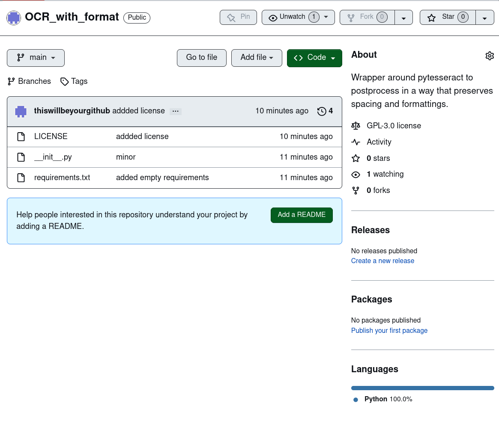

# OCR_with_format
* simple wrapper that postprocesses pytesseract's hOCR output to maintain format and spacings.

## Example

* Image:
  * 
* output from `python ./__init__.py ./screenshot.png --thresholding_method="all"  --quiet`
```
                                                                    @Unwateh (1) ~        Fork (3)                  (©
    OCR_with_format                          [     Pir ][                   | [  &            <) [     s        -]
                                                                                          About
                                                                                                                              &
                                                                                          Wrapper around pytesseract to
¥ Branches  © Tags                                                                     postprocess in a way that preserves
                                                                                          spacing and formattings.
  i  thiswillbeyourgithub addded license                        10 minutes ago  O 4
                                                                                          &5 GPL-3.0 license
  @  LICENSE            addded license                             10 minutes ago    - Activity
  [u]  __init__.py           minor                                      11 minutes ago     ¢ Ostars
  [u]  requirements.txt       added empty requirements                  11 minutes ago    <& 1 watching
                                                                                          Y  Oforks
  Help people interested in this repository understand your project by
  adding a README.                                                                      Releases
                                                                                          Create No releases a new published release
                                                                                          Packages
                                                                                          No packages published
                                                                                          Publish your first package
                                                                                          Languages
                                                                                          ———
                                                                                           ® Python 100.0%
```
* output from `python ./__init__.py ./screenshot.png --quiet --comparison_run`
  *
```
OCR_with_format

[ pin | [ @unwateh (@) ~ | [ & Fork (O)

-] [ ¢ s (0

-

&

   About

¥ Branches

© Tags

Wrapper around pytesseract to

postprocess in a way that preserves

spacing and formattings.

i thiswillbeyourgithub addded license

10 minutes ago 'O 4

&5 GPL-3.0 license

addded license

10 minutes ago

@ LICENSE

A- Activity

s

__init__.py

minor

11 minutes ago

¢ Ostars

s

requirements.txt

added empty requirements

11 minutes ago

® 1 watching

% 0forks

Help people interested in this repository understand your project by

Add a

ADME

adding a README.

Releases

No releases published

Create a new release

Packages

No packages published

Publish your first package

Languages

————

@ Python 100.0%
```
